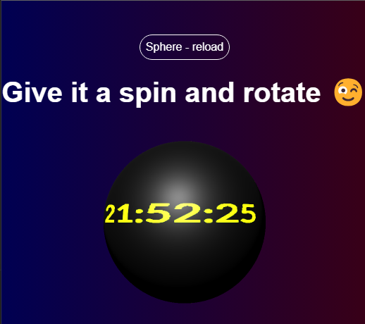

<h1 style="font-size: 30px;">Sphere in Three.js</h1>

### Description:
### A simple sphere animation created with Three.js. The sphere displays the current time and allows additional rotation through mouse interaction.

### Screenshot:

### Technologies:

 
 
 

- cd vite
- npm run dev
- npm run deploy (build and deploy to gh-pages)
